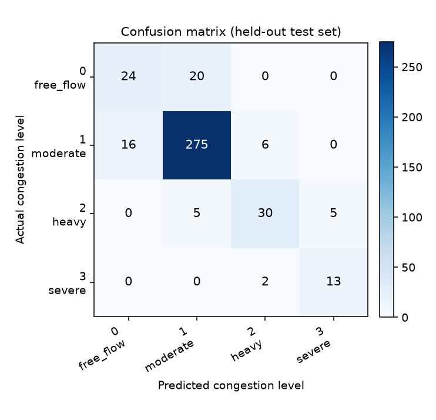

# Traffic Congestion Model Report

Generated 2026-10-05T10:15:40.166856+00:00 by `python -m ml.evaluate`.

> **The training data is simulated.** Every figure below describes performance on a synthetic fixture generated by `ml/data/sample/generate_simulated_dataset.py`, not on real traffic. The numbers demonstrate that the pipeline works end to end. They are not evidence about real-world congestion and must not be quoted as such.

## Run summary

| Item | Value |
| --- | --- |
| Model | Random Forest Classifier (`random_forest`) |
| Model version | 4.0.0 |
| Trained at | 2026-10-05T10:15:21.889413+00:00 |
| Dataset | `traffic_processed.csv` (1980 rows) |
| Target | `congestion_level` |
| Features | 26 |
| Split | chronological at `2026-01-16 05:00:00` |
| Train / test rows | 1584 / 396 |

## Held-out metrics

Macro F1 is the primary metric: it weights every congestion level equally, so a model cannot look good by predicting only the most common level.

| Metric | Score |
| --- | --- |
| Accuracy | 0.8636 |
| Balanced accuracy | 0.7720 |
| **F1 (macro)** | **0.7625** |
| Precision (macro) | 0.7571 |
| Recall (macro) | 0.7720 |
| F1 (weighted) | 0.8620 |

### Per-class detail

| Class | Name | Precision | Recall | F1 | Support |
| --- | --- | --- | --- | --- | --- |
| 0 | free_flow | 0.6000 | 0.5455 | 0.5714 | 44 |
| 1 | moderate | 0.9167 | 0.9259 | 0.9213 | 297 |
| 2 | heavy | 0.7895 | 0.7500 | 0.7692 | 40 |
| 3 | severe | 0.7222 | 0.8667 | 0.7879 | 15 |

### Confusion matrix

Rows are actual levels, columns are predicted levels, ordered [0, 1, 2, 3].

```
[[ 24  20   0   0]
 [ 16 275   6   0]
 [  0   5  30   5]
 [  0   0   2  13]]
```



## Baseline comparison

The baseline always predicts `moderate` (class 1), the most frequent class in the training window. Choosing it from the training data rather than the test labels keeps test information out of the comparison.

| Metric | Model | Baseline | Delta |
| --- | --- | --- | --- |
| Accuracy | 0.8636 | 0.7500 | +0.1136 |
| F1 (macro) | 0.7625 | 0.2143 | +0.5482 |

**Verdict:** beats the majority-class baseline on both accuracy and macro F1.

## Class distribution

| Class | Train rows | Test rows |
| --- | --- | --- |
| 0 | 389 | 44 |
| 1 | 716 | 297 |
| 2 | 322 | 40 |
| 3 | 157 | 15 |

> **Caution:** class 3 is 9.9% of the training data; class 3 has only 15 test rows, so its per-class scores are unstable. Rare-level scores are unstable and should not be read as precise estimates.

## Leakage control

- The target is derived from `speed_ratio`, so the contemporaneous `avg_speed_kph`, `flow_veh_per_hr`, `occupancy_pct` and `speed_ratio` measurements are excluded from the model's inputs. Training refuses to run if any of them appears in the feature set.
- The split is chronological, never random: the model is always scored on timestamps it has not seen.
- `speed_ratio` is recomputed from its components at inference time rather than accepted from the caller, so the target quantity cannot enter through the input.
- Lag and rolling features read strictly backwards within each road segment.

## Top features by importance

| Rank | Feature | Importance |
| --- | --- | --- |
| 1 | `speed_ratio_lag_1` | 0.1819 |
| 2 | `avg_speed_kph_lag_1` | 0.1332 |
| 3 | `hour` | 0.1309 |
| 4 | `temperature_c` | 0.0898 |
| 5 | `speed_ratio_rolling_mean_3` | 0.0694 |
| 6 | `speed_ratio_lag_2` | 0.0623 |
| 7 | `speed_ratio_rolling_mean_6` | 0.0596 |
| 8 | `speed_ratio_lag_3` | 0.0563 |
| 9 | `avg_speed_kph_lag_3` | 0.0513 |
| 10 | `avg_speed_kph_lag_2` | 0.0466 |
| 11 | `day_of_week` | 0.0301 |
| 12 | `is_weekend` | 0.0236 |
| 13 | `day_of_month` | 0.0143 |
| 14 | `road_segment_id__SEG_06` | 0.0130 |
| 15 | `free_flow_speed_kph` | 0.0124 |

## Reproduce

```bash
python -m ml.train
python -m ml.evaluate
python -m ml.predict <input.csv>
```

Full metrics: `evaluation_results.json`. Model: `traffic_model.pkl`.
